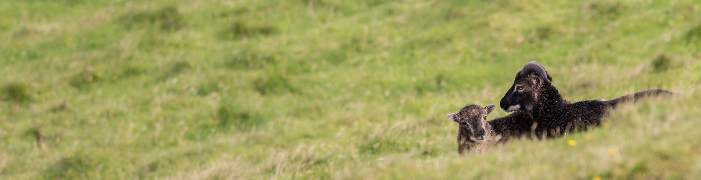

# Code for:

**Martin A Stoffel**, Susan E Johnston, Jill G Pilkington, Josephine M Pemberton, *Purifying and balancing selection on embryonic semi-lethal haplotypes in a wild mammal*, Evolution Letters, 2023;, qrad053, https://doi.org/10.1093/evlett/qrad053

 

### Project
Embryonic lethal mutations prevent individuals from being born, and can be seen as the earliest and most severe manifestation of inbreeding depression. Yet, we barely know anything about embryonic lethals in wild mammal populations, because it needs large samples of genomic data an detailed pedigrees to discover them. Here, we use dense SNP chip, fitness and pedigree data for a wild population of Soay Sheep on St. Kilda to identify embryonic lethals and quantify their effects.

### Code structure

**1a_ - 1e_:** Create haplotypes using `shapeit4`

**2a_haplotype_analysis:** Genome scan for embryonic lethal haplotypes

**2b_comp_hap_fitness:**  Combine haplotype and fitness data for each individual

**3a_genedrop:** Gene dropping simulations to test for selection 

**3a2_genedrop_w_rec.R:** Gene dropping including recombination

**3b_genedrop_processing:** Processing gene dropping results and plotting

**4a_hap_glmms:** GLMMs to test for postnatal fitness effects of semi-lethal haplotypes

**4b_hap_animal_models:** like 4a, but with animal models (not in paper)

**4c_plot_models:** Plotting model results

**5_manhattan_plot_hap_hom_results:** Plotting haplotype homozygosity results (2a)

**6_envelope_popgen:** Haplotype frequency projections using single locus popgen theory

**99s:** Supplementary material
